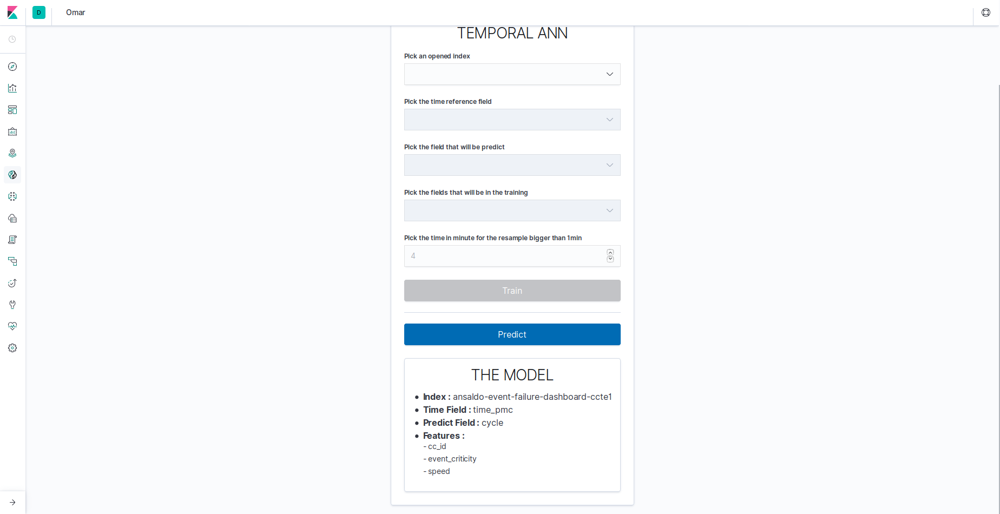

<div align="left">
 
</div>
<br/>
<br/>

# Omar plugin for Kibana: Machine Learning made easy

## The project

Omar is a Machine Learning Kibana plugin that predict a time-based field stored in an Elasticsearch index according to a specified list of features stored in the same index.
It is based on Google tensorflow JS.

## Prerequisites

### ElasticStack environment

* Elasticsearch 7.1.1
* Kibana 7.1.1

## Installation

### Windows

  ```
  ./kibana-plugin.bat install file:///C:/path_to_omar_plugin/omar-1.0.0.zip
  ```

### Linux

 ```
 ./kibana-plugin.sh install file:///path_to_omar_plugin/omar-1.0.0.zip
 ```

## Use

1. Select an opened index
2. Select a time field
3. Select the target field to predict
4. Select the features (i.e the fields that will be taken into account in the prediction)
5. Launch the Training, clicking the 'Train' button
6. Once the Training is done, you can launch the Prediction, clicking the 'Predict' button.

Notes:
* The Training is launched on ALL the documents stored in the index at the time you click on the 'Train' button.
* The Prediction is launched on ALL the documents stored in the index at the time you click on the 'Predict' button.

The hypothesis behind this behaviour is that your index is living. Thus, the number of documents taken into account in the Training is always lower than the number of documents taken into account at the time of the Prediction. This time-based prediction is particularly interesting for logs treatment.


<br/>
<br/>
<div align="center">
  
</div>
<div align="center">
  
</div>

## Options

kibana.yml

```
 omar.enabled = true
 omar.bulkQueueSize = 500
 omar.index.timefieldPredictOutputIndex = 'timefield'
 omar.index.prefixPredictOutputIndex = 'omar-predict'
 omar.index.prefixSortedIndex = '.omar-tmp'
 omar.model.path = '../plugins/omar/model'
 omar.model.index = '.omar-model'
 omar.socketPort = 3000
 omar.qualitativeThreshold.value = 0.15
 ```


## Changelog

| Version  | Improvment |
| -------- | ---------- |
| 2.0.0  |  Integrating a model versioning system |
| 1.0.0  |  Initial version |


## Development

See the [kibana contributing guide](https://github.com/elastic/kibana/blob/master/CONTRIBUTING.md) for instructions setting up your development environment. Once you have completed that, use the following yarn scripts.

  - `yarn kbn bootstrap`

    Install dependencies and crosslink Kibana and all projects/plugins.

    > ***IMPORTANT:*** Use this script instead of `yarn` to install dependencies when switching branches, and re-run it whenever your dependencies change.

  - `yarn start`

    Start kibana and have it include this plugin. You can pass any arguments that you would normally send to `bin/kibana`

      ```
      yarn start --elasticsearch.hosts http://localhost:9220
      ```

  - `yarn build`

    Build a distributable archive of your plugin.

  - `yarn test:browser`

    Run the browser tests in a real web browser.

  - `yarn test:server`

    Run the server tests using mocha.

For more information about any of these commands run `yarn ${task} --help`. For a full list of tasks checkout the `package.json` file, or run `yarn run`.

## The team

This project has been realised by [Pacte Novation](https://www.pactenovation.fr/), a french start-up based in Paris.
If you need more information on it, feel free to contact us at: 

**pgithub@pactenovation.fr**

<br/>
<br/>
<div align="center">
  
</div>

